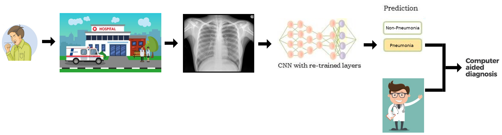
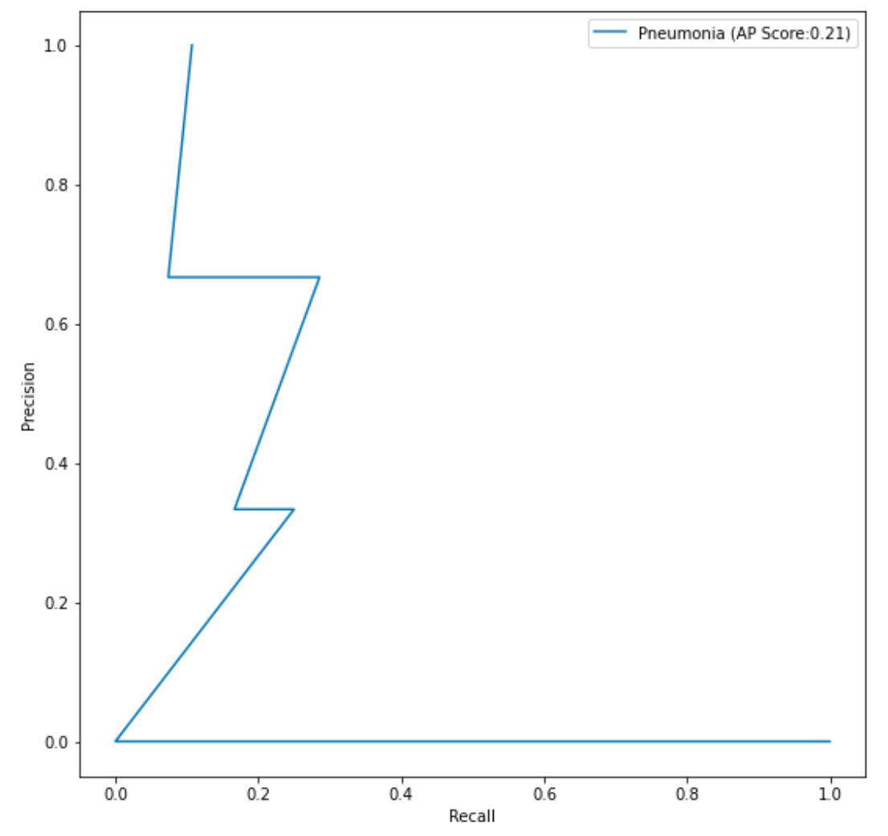

# FDA  Submission

**Your Name:** 
Juan Carlos Kuri Pinto

**Name of your Device:** 
Pneumonia Detector From Chest X-Rays

## Algorithm Description 

### 1. General Information

**Intended Use Statement:** 
This software will help doctors diagnose pneumonia from chest X-rays.

**Indications for Use:**

If you carefully examine the distribution of ages of the patients of which the model was trained and validated, you will notice that the big majority of patients have an age between 20 and 70 years. Patients whose age is outside such age range will probably receive a wrong diagnose from this device; and this device have not received enough training in those cases.

<p align='center'></p>

This kind of bias does not occur regarding the gender of patients. Male patients and female patients have similar proportions. So, this device works properly in both sexes.

**Device Limitations:**

As stated above, the big majority of patients have an age between 20 and 70 years. Patients whose age is outside such age range will probably receive a wrong diagnose from this device. Because there are few patients who are too young or too old; and this device have not received enough training in those cases.

If you carefully examine the distribution of comorbidities, the diseases which are comorbid with pneumonia, you will notice that some diseases like Infiltration, Edema, Effusion, and Atelectasis are highly correlated with pneumonia. It is well known that the bigger the correlation of the comorbidity, the more confusion will cause in this device. In fact, the only mistake this device committed in the FDA Validation Dataset was a patient with **Effusion**, a comorbidity highly correlated with pneumonia. Hence, the device was confused. A good recommendation to doctors is to pay special attention to the automated diagnoses of patients with comorbidities highly correlated with pneumonia.

<p align='center'></p>

This device will also fail with patients with medical implants in the chest area like metal bones, screws, machines, and so on. Because those medical implants will appear very bright in the X-ray, confusing the device.

Moreover, the device only works with chest X-rays with the DICOM format. If you use other file format, the software won't be able to read the file. If you take other type of X-ray, other body part different than the chest, or other type of medical image, the software will produce erroneous results.

**Clinical Impact of Performance:**

How false positives might affect a patient?<br/>
False positives might alarm doctors in vain. They will lose some time confirming that patients really have pneumonia. Doctors will experience fatigue more often and will commit more mistakes, which negatively affects patients. If doctors also believe that a false positive is a positive case of pneumonia, patients will be alarmed in vain. Patients will spend more time and more money doing unnecessary additional exams in order to further investigate their cases. Some patients will even take unnecessary medication.

How false negatives might affect a patient?<br/>
False negatives could cloud doctors' judgement. They could skip a real case of pneumonia, which could be fatal for patients who really have pneumonia.

### 2. Algorithm Design and Function

Basically, the features learned by a VGG16 convnet were transferred from the more general domain of ImageNet images to the specific domain of chest X-ray images. The original VGG16 convnet was trained with photos of many kinds of objects. It has 1000 categories. Whereas the new convnet lacks the last layer and adds 3 new layers. The new convnet was trained to discriminate between chest X-Ray images of patients with and without pneumonia. So, it has 2 categories: Pneumonia and non-pneumonia.

<p align='center'></p>

The function of this device could be summarize in these steps. First, a patient has some kind of breathing difficulty. Then, the patient goes to the hospital. Doctors take a chest X-ray of the patient. Then, the chest X-ray DICOM file is fed into the CNN of this device. This device suggests a diagnosis in 1 second: Pneumonia or non-pneumonia. This computerized diagnosis helps doctors to finally make a **Computer Aided Diagnosis (CAD)**, which is a powerful synergy between doctors and artificial intelligence. This computerized help also seeks to prevent doctors from getting burnout. Sometimes doctors are overwhelmed by work.

<p align='center'></p>

**DICOM Checking Steps:**

Doctors only need to take a chest X-ray. The machine will generate a DICOM file like this:

```
test1.dcm

(0008, 0016) SOP Class UID                       UI: Secondary Capture Image Storage
(0008, 0018) SOP Instance UID                    UI: 1.3.6.1.4.1.11129.5.5.110503645592756492463169821050252582267888
(0008, 0060) Modality                            CS: 'DX'
(0008, 1030) Study Description                   LO: 'No Finding'
(0010, 0020) Patient ID                          LO: '2'
(0010, 0040) Patient's Sex                       CS: 'M'
(0010, 1010) Patient's Age                       AS: '81'
(0018, 0015) Body Part Examined                  CS: 'CHEST'
(0018, 5100) Patient Position                    CS: 'PA'
(0020, 000d) Study Instance UID                  UI: 1.3.6.1.4.1.11129.5.5.112507010803284478207522016832191866964708
(0020, 000e) Series Instance UID                 UI: 1.3.6.1.4.1.11129.5.5.112630850362182468372440828755218293352329
(0028, 0002) Samples per Pixel                   US: 1
(0028, 0004) Photometric Interpretation          CS: 'MONOCHROME2'
(0028, 0010) Rows                                US: 1024
(0028, 0011) Columns                             US: 1024
(0028, 0100) Bits Allocated                      US: 8
(0028, 0101) Bits Stored                         US: 8
(0028, 0102) High Bit                            US: 7
(0028, 0103) Pixel Representation                US: 0
(7fe0, 0010) Pixel Data                          OW: Array of 1048576 elements
```

If the DICOM file that was taken by the X-ray machine has similar data, everything should work correctly. Modality should be 'DX'. Body Part Examined should be 'CHEST'. Patient Position should be either 'PA' or 'AP'. Photometric Interpretation should be MONOCHROME. Brightness levels should be in the range [0,1]. Other color spaces are not supported.

**Preprocessing Steps:**

Basically, the image from the field `Pixel Data` should be resized to match the following dimensions: `IMG_SIZE = (1, 224, 224, 3)`. Where `1` means the batch size of `1` image. `3` means the RGB color space. The image of `Pixel Data` should be transformed from grayscale to the RGB colorspace. And `224, 224` is the input size of the convolutional neural network capable of recognizing the patterns of pneumonia and non-pneumonia.

**CNN Architecture:**

Basically, the CNN architecture is VGG16 with pretrained weights whose last layer was removed and 3 new fully-connected layers were added:

```
    new_model.add(Dense(1024 * 2, activation='relu'))
    new_model.add(Dropout(0.25))
    new_model.add(Dense(1024, activation='relu'))
    new_model.add(Dropout(0.25))
    new_model.add(Dense(1, activation='sigmoid'))
```

Here is a summary of the CNN architecture:

```
Model: "sequential_1"
_________________________________________________________________
Layer (type)                 Output Shape              Param #   
=================================================================
block1_conv1 (Conv2D)        (None, 224, 224, 64)      1792      
_________________________________________________________________
block1_conv2 (Conv2D)        (None, 224, 224, 64)      36928     
_________________________________________________________________
block1_pool (MaxPooling2D)   (None, 112, 112, 64)      0         
_________________________________________________________________
block2_conv1 (Conv2D)        (None, 112, 112, 128)     73856     
_________________________________________________________________
block2_conv2 (Conv2D)        (None, 112, 112, 128)     147584    
_________________________________________________________________
block2_pool (MaxPooling2D)   (None, 56, 56, 128)       0         
_________________________________________________________________
block3_conv1 (Conv2D)        (None, 56, 56, 256)       295168    
_________________________________________________________________
block3_conv2 (Conv2D)        (None, 56, 56, 256)       590080    
_________________________________________________________________
block3_conv3 (Conv2D)        (None, 56, 56, 256)       590080    
_________________________________________________________________
block3_pool (MaxPooling2D)   (None, 28, 28, 256)       0         
_________________________________________________________________
block4_conv1 (Conv2D)        (None, 28, 28, 512)       1180160   
_________________________________________________________________
block4_conv2 (Conv2D)        (None, 28, 28, 512)       2359808   
_________________________________________________________________
block4_conv3 (Conv2D)        (None, 28, 28, 512)       2359808   
_________________________________________________________________
block4_pool (MaxPooling2D)   (None, 14, 14, 512)       0         
_________________________________________________________________
block5_conv1 (Conv2D)        (None, 14, 14, 512)       2359808   
_________________________________________________________________
block5_conv2 (Conv2D)        (None, 14, 14, 512)       2359808   
_________________________________________________________________
block5_conv3 (Conv2D)        (None, 14, 14, 512)       2359808   
_________________________________________________________________
block5_pool (MaxPooling2D)   (None, 7, 7, 512)         0         
_________________________________________________________________
flatten (Flatten)            (None, 25088)             0         
_________________________________________________________________
fc1 (Dense)                  (None, 4096)              102764544 
_________________________________________________________________
fc2 (Dense)                  (None, 4096)              16781312  
_________________________________________________________________
dense_1 (Dense)              (None, 2048)              8390656   
_________________________________________________________________
dropout_1 (Dropout)          (None, 2048)              0         
_________________________________________________________________
dense_2 (Dense)              (None, 1024)              2098176   
_________________________________________________________________
dropout_2 (Dropout)          (None, 1024)              0         
_________________________________________________________________
dense_3 (Dense)              (None, 1)                 1025      
=================================================================
Total params: 144,750,401
Trainable params: 10,489,857
Non-trainable params: 134,260,544
```

### 3. Algorithm Training

**Parameters:**
* Types of augmentation used during training: horizontal_flip = True, vertical_flip = False, height_shift_range = 0.1, width_shift_range = 0.1, rotation_range = 20, shear_range = 0.1, zoom_range = 0.1
* Batch size: 64
* Optimizer learning rate: Adam optimizer and learning rate of 0.0001.
* Layers of pre-existing architecture that were frozen: 134,260,544 Non-trainable params
* Layers of pre-existing architecture that were fine-tuned: 10,489,857 Trainable params
* Layers added to pre-existing architecture:
```
    new_model.add(Dense(1024 * 2, activation='relu'))
    new_model.add(Dropout(0.25))
    new_model.add(Dense(1024, activation='relu'))
    new_model.add(Dropout(0.25))
    new_model.add(Dense(1, activation='sigmoid'))
```

**Algorithm training performance:**

**Learning curve: Loss versus epochs**
<p align='center'></p>

**Learning curve: Accuracy versus epochs**
<p align='center'></p>

**P-R curve (Precision versus Recall)**<br/>
<p align='center'></p>

**AUC curve (Area Under Curve)**<br/>
The closer is the curve to the upper left corner, the better. AUC = 0.72. The closer AUC is to 1, the better.
<p align='center'></p>

**Final Threshold and Explanation:**

The API generated many tentative thresholds for the final activation. If `activation >= threshold`, then the classifier suggests pneumonia. Otherwise, the classifier suggest non-pneumonia. All tentative thresholds produce different values for the F1-score. The optimal threshold is the one that produces the maximal F1-score.

<p align='center'></p>

```
Optimal threshold: 0.4412, Maximum F1-score: 0.5000
```

### 4. Databases

The database used for training and validation is the file `Data_Entry_2017.csv`. This datase is described in the paper:

ChestX-ray8: Hospital-scale Chest X-ray Database and Benchmarks on Weakly-Supervised Classification and Localization of Common Thorax Diseases (by Xiaosong Wang et al) https://arxiv.org/abs/1705.02315

Here are some visual examples found in such database. The classifier is somewhat accurate: 93.75% accuracy in the validation dataset. In the graph, `G` means ground truth and `P` means prediction. For example: `1G,1P` means 1 (pneumonia found) in ground truth and 1 pneumonia predicted by the classifier.

<p align='center'></p>

**Description of Training Dataset and Validation Dataset:** 

```
Pneumonia cases: 1431 (1.28%)
Non-pneumonia cases: 110689 (98.72%)
Due to the very imbalance nature of the pneumonia cases versus non-pneumonia cases (1.28:98.72),
both the training dataset and the validation dataset were balanced with a proportion of (1:5).

1144 (pneumonia train) + 5720 (non_pneumonia train) = 6864 (all train)
287 (pneumonia val) + 1435 (non_pneumonia val) = 1722 (all val)
```

The training dataset has many augmentations:

```
horizontal_flip = True, 
vertical_flip = False, 
height_shift_range = 0.1, 
width_shift_range = 0.1, 
rotation_range = 20, 
shear_range = 0.1, 
zoom_range = 0.1
```

Whereas the validation and test datasets have no augmentations.

### 5. Ground Truth

The **gold standard** for detecting pneumonia in chest X-ray images is to send a biopsy to the laboratory. This method is super accurate to consider it ground truth. But it is more expensive and slower.

The **silver standard** for detecting pneumonia in chest x-ray images is to make some experts vote with their diagnoses. Each expert has different weight depending on his/her experience. Another method is to extract diagnoses from text sources via NLP algorithms. These methods are less accurate, cheaper, and faster.

Ideally, ground truth should be created using the gold standard. However, the silver standard is often used due to the limited availability of resources.

For more information about how the dataset with ground truth was created, please read the following paper:<br/>
ChestX-ray8: Hospital-scale Chest X-ray Database and Benchmarks on Weakly-Supervised Classification and Localization of Common Thorax Diseases (by Xiaosong Wang et al)<br/>
https://arxiv.org/abs/1705.02315

If you read that paper, you will notice that both the gold standard (biopsy to laboratory) and the silver standard (diagnoses of experts and NLP text-mining) were applied to label the dataset used to train and to validate this model.

### 6. FDA Validation Plan

**Patient Population Description for FDA Validation Dataset:**

**Gender of patients**

<p align='center'></p>

This dataset is slightly biased toward male patients.

**Age of patients**

<p align='center'></p>

Patients in their 50s are the most common type of patient in this dataset.

**Distribution of Diseases**

<p align='center'></p>

No Finding (53.84%) is the most common finding, followed by Infiltration (17.74%) and Effusion (11.87%).
The most uncommon finding is Hernia (0.20%), followed by Pneumonia (1.28%), the disease we want to detect.

**Distribution of diseases that are comorbid with pneumonia**

<p align='center'></p>

The most common comorbidities that accompany pneumonia are Infiltration (42.27%) and Edema (23.75%).
Given the high correlation of these diseases with Pneumonia, the datasets should be balanced regarding these correlations. Random sampling helps to alleviate this kind of biases.

**Pneumonia cases versus non-pneumonia cases**

<p align='center'></p>

Pneumonia cases are really rare, creating an unbalanced dataset.
Sampling should be done in a special way in order to overcome this unbalance.

**Number of diseases per patient**

<p align='center'></p>

Patients with no diseases are very common (53.84%) in this dataset.
Patients with 1 disease are almost 30% of the dataset.
Patients with 2 diseases are slightly above 10% of the dataset.
Patients with 3 diseases or more are rare.

**Number of follow-ups of patients**

<p align='center'></p>

In this dataset, most patients have few follow-ups.

-----

**Ground Truth Acquisition Methodology:**

The **gold standard** for detecting pneumonia in chest X-ray images is to send a biopsy to the laboratory. This method is super accurate to consider it ground truth. But it is more expensive and slower.

The **silver standard** for detecting pneumonia in chest x-ray images is to make some experts vote with their diagnoses. Each expert has different weight depending on his/her experience. Another method is to extract diagnoses from text sources via NLP algorithms. These methods are less accurate, cheaper, and faster.

Ideally, ground truth should be created using the gold standard. However, the silver standard is often used due to the limited availability of resources.

For more information about how the dataset with ground truth was created, please read the following paper:<br/>
ChestX-ray8: Hospital-scale Chest X-ray Database and Benchmarks on Weakly-Supervised Classification and Localization of Common Thorax Diseases (by Xiaosong Wang et al)<br/>
https://arxiv.org/abs/1705.02315

If you read that paper, you will notice that both the gold standard (biopsy to laboratory) and the silver standard (diagnoses of experts and NLP text-mining) were applied to label the dataset used to train and to validate this model.

However, the test dataset of the FDA's Validation Plan most probably uses the gold standard to create ground truth labels.

**Algorithm Performance Standard:**

The model managed to achieve excellent accuracies:<br/>
Validation Accuracy = 93.75%<br/>
Testing Accuracy = 100%

`Accuracy = (TP + TN) / (TP + TN + FP + FN)`

```
train_loss: 0.4956 - train_binary_accuracy: 0.8100 
val_loss: 0.2666 - val_binary_accuracy: 0.9375
AUC=0.72
AP Score=0.41
Optimal threshold: 0.4412, Maximum F1-score: 0.5000
Accuracy at optimal threshold (0.4412): 0.9375
test_binary_accuracy: 1.0
```

```
test1.dcm, Study description: No Finding, ground_truth=False, prediction=False (CORRECT)
test2.dcm, Study description: Cardiomegaly, ground_truth=False, prediction=False (CORRECT)
test3.dcm, Study description: Effusion, ground_truth=False, prediction=False (CORRECT)
test4.dcm, Study description: No Finding, ground_truth=False, prediction=False (CORRECT)
test5.dcm, Study description: No Finding, ground_truth=False, prediction=False (CORRECT)
test6.dcm, Study description: No Finding, ground_truth=False, prediction=False (CORRECT)
ACCURACY=100.00%
```
