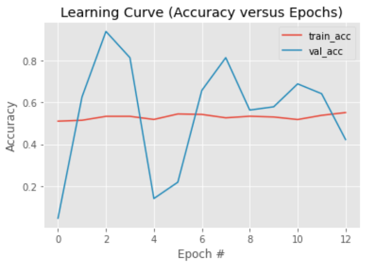

# FDA  Submission

**Your Name:** 
Juan Carlos Kuri Pinto

**Name of your Device:** 
Pneumonia Detector From Chest X-Rays

## Algorithm Description 

### 1. General Information

**Intended Use Statement:** 
This software will help doctors diagnose pneumonia from chest X-rays.

**Indications for Use:**
Take a chest X-ray. Use the resulting file as an input for this software. The software will suggest whether that patient has pneumonia or not with an accuracy of 93.75% in the validation dataset. Human doctors can use this suggestion in order to help and to accelerate the diagnosis of pneumonia. In this way, doctor will avoid burnout.

**Device Limitations:**
The device only works with chest X-rays with the DICOM format. If you use other file format, the software won't be able to read the file. If you take other type of X-ray or other type of medical image, the software will produce erroneous results.

**Clinical Impact of Performance:**

How false positives might affect a patient?<br/>
False positives might alarm doctors in vain. They will lose some time confirming that patients really have pneumonia.

How false negatives might affect a patient?<br/>
False negatives could cloud doctors' judgement. They could skip a real case of pneumonia.

### 2. Algorithm Design and Function

<< Insert Algorithm Flowchart >>

<center></center>

**DICOM Checking Steps:**

Doctors only need to take a chest X-ray. The machine will generate a DICOM file like this:

```
test1.dcm

(0008, 0016) SOP Class UID                       UI: Secondary Capture Image Storage
(0008, 0018) SOP Instance UID                    UI: 1.3.6.1.4.1.11129.5.5.110503645592756492463169821050252582267888
(0008, 0060) Modality                            CS: 'DX'
(0008, 1030) Study Description                   LO: 'No Finding'
(0010, 0020) Patient ID                          LO: '2'
(0010, 0040) Patient's Sex                       CS: 'M'
(0010, 1010) Patient's Age                       AS: '81'
(0018, 0015) Body Part Examined                  CS: 'CHEST'
(0018, 5100) Patient Position                    CS: 'PA'
(0020, 000d) Study Instance UID                  UI: 1.3.6.1.4.1.11129.5.5.112507010803284478207522016832191866964708
(0020, 000e) Series Instance UID                 UI: 1.3.6.1.4.1.11129.5.5.112630850362182468372440828755218293352329
(0028, 0002) Samples per Pixel                   US: 1
(0028, 0004) Photometric Interpretation          CS: 'MONOCHROME2'
(0028, 0010) Rows                                US: 1024
(0028, 0011) Columns                             US: 1024
(0028, 0100) Bits Allocated                      US: 8
(0028, 0101) Bits Stored                         US: 8
(0028, 0102) High Bit                            US: 7
(0028, 0103) Pixel Representation                US: 0
(7fe0, 0010) Pixel Data                          OW: Array of 1048576 elements
```

If the DICOM file that was taken by the X-ray machine has similar data, everything should work correctly. Modality should be 'DX'. Body Part Examined should be 'CHEST'. Patient Position should be either 'PA' or 'AP'. Photometric Interpretation should be MONOCHROME. Brightness levels should be in the range [0,1]. Other color spaces are not supported.

**Preprocessing Steps:**

Basically, the image from the field `Pixel Data` should be resized to match the following dimensions: `IMG_SIZE = (1, 224, 224, 3)`. Where `1` means the batch size of `1` image. `3` means the RGB color space. The image of `Pixel Data` should be transformed from grayscale to the RGB colorspace. And `224, 224` is the input size of the convolutional neural network capable of recognizing the patterns of pneumonia and non-pneumonia.

**CNN Architecture:**

Basically, the CNN architecture is VGG16 with pretrained weights whose last layer was removed and 3 new fully-connected layers were added:

```
    new_model.add(Dense(1024 * 2, activation='relu'))
    new_model.add(Dropout(0.25))
    new_model.add(Dense(1024, activation='relu'))
    new_model.add(Dropout(0.25))
    new_model.add(Dense(1, activation='sigmoid'))
```

Here is a summary of the CNN architecture:

```
Model: "sequential_1"
_________________________________________________________________
Layer (type)                 Output Shape              Param #   
=================================================================
block1_conv1 (Conv2D)        (None, 224, 224, 64)      1792      
_________________________________________________________________
block1_conv2 (Conv2D)        (None, 224, 224, 64)      36928     
_________________________________________________________________
block1_pool (MaxPooling2D)   (None, 112, 112, 64)      0         
_________________________________________________________________
block2_conv1 (Conv2D)        (None, 112, 112, 128)     73856     
_________________________________________________________________
block2_conv2 (Conv2D)        (None, 112, 112, 128)     147584    
_________________________________________________________________
block2_pool (MaxPooling2D)   (None, 56, 56, 128)       0         
_________________________________________________________________
block3_conv1 (Conv2D)        (None, 56, 56, 256)       295168    
_________________________________________________________________
block3_conv2 (Conv2D)        (None, 56, 56, 256)       590080    
_________________________________________________________________
block3_conv3 (Conv2D)        (None, 56, 56, 256)       590080    
_________________________________________________________________
block3_pool (MaxPooling2D)   (None, 28, 28, 256)       0         
_________________________________________________________________
block4_conv1 (Conv2D)        (None, 28, 28, 512)       1180160   
_________________________________________________________________
block4_conv2 (Conv2D)        (None, 28, 28, 512)       2359808   
_________________________________________________________________
block4_conv3 (Conv2D)        (None, 28, 28, 512)       2359808   
_________________________________________________________________
block4_pool (MaxPooling2D)   (None, 14, 14, 512)       0         
_________________________________________________________________
block5_conv1 (Conv2D)        (None, 14, 14, 512)       2359808   
_________________________________________________________________
block5_conv2 (Conv2D)        (None, 14, 14, 512)       2359808   
_________________________________________________________________
block5_conv3 (Conv2D)        (None, 14, 14, 512)       2359808   
_________________________________________________________________
block5_pool (MaxPooling2D)   (None, 7, 7, 512)         0         
_________________________________________________________________
flatten (Flatten)            (None, 25088)             0         
_________________________________________________________________
fc1 (Dense)                  (None, 4096)              102764544 
_________________________________________________________________
fc2 (Dense)                  (None, 4096)              16781312  
_________________________________________________________________
dense_1 (Dense)              (None, 2048)              8390656   
_________________________________________________________________
dropout_1 (Dropout)          (None, 2048)              0         
_________________________________________________________________
dense_2 (Dense)              (None, 1024)              2098176   
_________________________________________________________________
dropout_2 (Dropout)          (None, 1024)              0         
_________________________________________________________________
dense_3 (Dense)              (None, 1)                 1025      
=================================================================
Total params: 144,750,401
Trainable params: 10,489,857
Non-trainable params: 134,260,544
```

### 3. Algorithm Training

**Parameters:**
* Types of augmentation used during training
* Batch size
* Optimizer learning rate
* Layers of pre-existing architecture that were frozen
* Layers of pre-existing architecture that were fine-tuned
* Layers added to pre-existing architecture

<< Insert algorithm training performance visualization >> 

<< Insert P-R curve >>

<center></center>

<center></center>

<center></center>

<center></center>

<center></center>

**Final Threshold and Explanation:**

<center></center>

### 4. Databases
 (For the below, include visualizations as they are useful and relevant)

**Description of Training Dataset:** 


**Description of Validation Dataset:** 


### 5. Ground Truth


### 6. FDA Validation Plan

**Patient Population Description for FDA Validation Dataset:**

**Ground Truth Acquisition Methodology:**

**Algorithm Performance Standard:**
